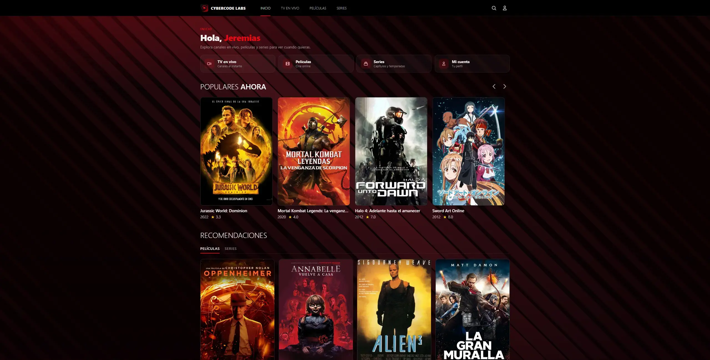
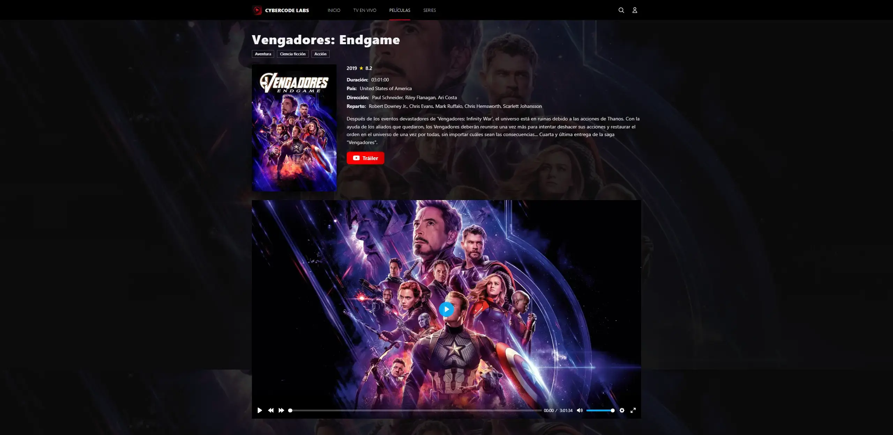

<p align="center">
  
</p>

<h1 align="center">PHP IPTV Player</h1>

<p align="center">
  Lightweight PHP IPTV web client — compatible with the Xtream UI API.
</p>

<p align="center">
  <a href="https://github.com/cybercodelabs/php-iptv-player"></a>
  
  
  
  <a href="LICENSE"></a>
</p>

<p align="center">
  <a href="https://hits.sh/github.com/cybercodelabs/php-iptv-player/">
    
  </a>
</p>

---

## Description

**PHP IPTV Player** is a PHP IPTV web client in a **base version**, for authenticating users and consuming live TV, movies, and series from Xtream UI–compatible servers. No database and no complex infrastructure at this stage.

> [!WARNING]
> It is a **web player / client**. It does not host or redistribute IPTV content: the catalog and streams are provided by the external server you configure (`XTREAM_HOST`).

See [DISCLAIMER.md](DISCLAIMER.md) for more details.

## Preview

<p align="center">
  
</p>

<p align="center">
  
</p>

## Architecture

Organized by features (`auth`, `live`, `movies`, `series`, `profile`, `player`) with presentation / domain / infrastructure layers.

```text
public/          # Front controller and public assets
src/Features/    # Business modules
src/Shared/      # Layout, helpers, middleware
src/Infrastructure/  # Config, session, Xtream client
templates/       # PHP views
routes/          # Web routes
```

## Requirements

- PHP 8.1+
- Extensions: `curl`, `json`, `mbstring`, `session`
- Composer 2.x
- Apache (`mod_rewrite`) or equivalent PHP server

## Modules

| Module | Status |
|--------|--------|
| Auth (login/logout + session) | Functional |
| Shared layout | Functional |
| Dashboard / Home | Functional |
| Live TV (`/channels`, `/channel`) | Functional |
| Movies / Series | Functional |
| Search | Functional |
| Profile | Functional |
| Player (VOD + HLS live) | Functional |

## Security

- Credentials stored in a **PHP session** (HttpOnly), not in clear-text cookies.
- Secrets only in `.env` (not committed).

## License

Released under the **MIT** license. See [LICENSE](LICENSE).

Copyright (c) 2026 CyberCode Labs.
